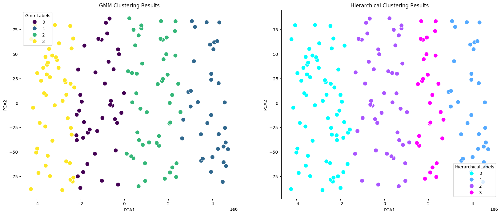

# End-to-End Consumer Segmentation for the Running-Footwear Market (Unsupervised ML)

Segmenting running-shoe consumers from survey data using unsupervised machine learning, to surface distinct customer groups and translate them into product and marketing recommendations. The workflow compares several clustering algorithms, selects one suited to the data, and profiles the resulting segments.

> **Academic group project** - Boopesh Mohanraj and Sai Prashanth Vaditha.

---

## Data

A consumer survey of **175 respondents** with **45 binary response features** (after dropping record/ID columns) covering:

- **Demographics** - country (US / UK / Japan), gender, age band
- **Running habits** - frequency, number of pairs owned, cross-training activities
- **Product preferences** - cushioning type, plate/foam/carbon preference, color palette
- **Complaints** - fast wear, too narrow, too heavy, not fashionable

The data was clean (no missing or duplicate records/IDs).

---

## Approach

**1. Exploratory analysis**
- Correlation heatmap across the response features
- **Cosine similarity** matrix between respondents - chosen deliberately because the data is binary, where cosine similarity compares response *patterns* better than Euclidean distance
- Outlier check via boxplot on scaled data (few outliers; minimal impact)

**2. Choosing a clustering method**

Four algorithms were compared — **KMeans, Gaussian Mixture (GMM), Agglomerative (Hierarchical), and DBSCAN** — using the elbow method and **silhouette score**:

| Method | Silhouette (k=4) | Notes |
| --- | --- | --- |
| Hierarchical | 0.62 | Highest score; rigid boundaries |
| KMeans | 0.56 | Avoided — Euclidean distance is [not recommended for binary data](https://www.ibm.com/support/pages/clustering-binary-data-k-means-should-be-avoided) |
| GMM | 0.56 | Chosen — even, well-separated, interpretable clusters |
| DBSCAN | — | Did not form usable clusters on this data |

**GMM** was selected as the primary model: it produces evenly distributed, flexibly shaped clusters that are easier to act on for segmentation, and it avoids KMeans' Euclidean-distance problem on binary features. Hierarchical clustering was kept as a comparison.

**3. Segmentation & profiling**
- Final GMM fit with **8 components**, profiling each segment by its mean feature values
- **PCA (2 components)** to visualize and compare GMM vs. Hierarchical cluster structure

---

## Cluster comparison

*The two methods projected onto the first two principal components. GMM (left) yields more evenly distributed, separable groups; Hierarchical (right) forms tighter but more overlapping boundaries - which is why GMM was preferred for actionable segmentation.*

---

## Segments found

The eight GMM segments profiled to interpretable consumer groups, for example:

- **US females, 25–34** - prefer soft pastels; complain products are "not fashionable"
- **Young males, 18–24** - few complaints; some dissatisfaction with weight
- **Mixed-gender younger group** - prefer "bright & bold"; fashion-sensitive
- **Male-dominated group** - dissatisfied with fast wear; prefer earth tones
- **US "keep-it-normal" group** - prefer conventional designs, few complaints

(Full profiles for all eight segments are in the notebook.)

From these, the project derives product recommendations (a "simple & versatile" line vs. a "fashion-forward" line, athlete collaborations, style-plus-function designs) and marketing recommendations (region- and gender-specific campaigns, athlete endorsements, event partnerships, influencer-led limited editions).

---

## Tech stack

| Layer | Tools |
| --- | --- |
| Language | Python 3 |
| Data | pandas, NumPy, openpyxl |
| Clustering | scikit-learn (KMeans, GMM, Agglomerative, DBSCAN), SciPy (linkage/dendrogram) |
| Dim. reduction | PCA |
| Visualization | matplotlib, seaborn |

---

## Limitations

- **Small sample.** 175 respondents is enough for a segmentation exercise but limits how confidently the segments generalize to the broader market.
- **Survey / self-report data.** Stated preferences are not observed purchase behavior; the segments describe attitudes, not verified buying patterns.
- **Cluster count.** The method-selection silhouette scores were computed at k=4, while the final GMM used 8 components for richer profiling - the 8-segment solution is chosen for interpretability rather than a single optimal-k metric.
- **No external validation.** Segments are validated by internal cohesion and interpretability, not against real marketing-response outcomes.

---

## How to run

1. Open the notebook in Google Colab (or Jupyter).
2. When prompted, upload `survey_data.xlsx` (the notebook uses Colab's file-upload).
3. Run cells top to bottom to reproduce the EDA, method comparison, GMM segmentation, and PCA visualizations.
